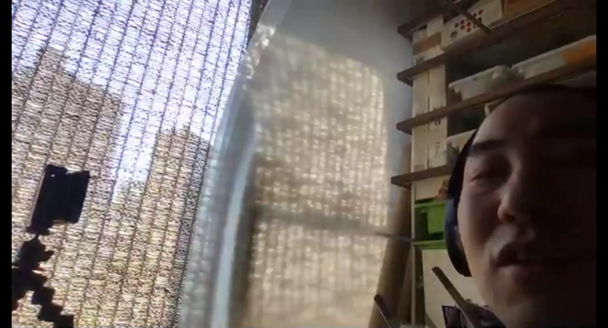

# 照明

---

太陽光がベスト。太陽光をうまく使うのが良いと思う。晴天じゃなくてうっすら曇り空でも良い。とにかく明るさに差がでないことが重要。

夜だけとか、朝から夕方にかけて撮影するときには太陽光は向かない。時間を置かずに一気に撮ろう。

太陽光は強くて電気代がかからない。光の強さが一定であることが大切。

太陽光は点光源なので、反射しすぎない乳白色のもの（ex.プラ段や障子紙など）をはさむと良い。

[**UTV**](https://www.youtube.com/channel/UCYRPjnHu16cevb7H7RcaYFA)の工作シーンはプラ段を使ってる。けど、障子紙でも良いな

---

小物を取る時は、ライティングボックスを自作しても良いかも、床と壁をマットな白い板で作って、天井として乳白色のプラ段や障子紙を貼る、うえから光源を落としてあげれば中に置いたものはキレイに照らされる。

あとは、背景として白いシートを置く場合は、壁と床を90°に貼り合わせるとどうしても線(影)ができる。そこで、一枚のシートを緩くカーブさせるようにして壁と床を繋げてやると、線が無くなって白く広い空間にモデルを置いたような映像が撮れる

向こう側にライトがあるときに、高さのあるものを撮影する場合は、こちら側にレフ板や他のライトを用意すると良い。

あとは、蛍光灯の光で動画撮るとチラつきが入っちゃうので、LED照明がおススメー！
