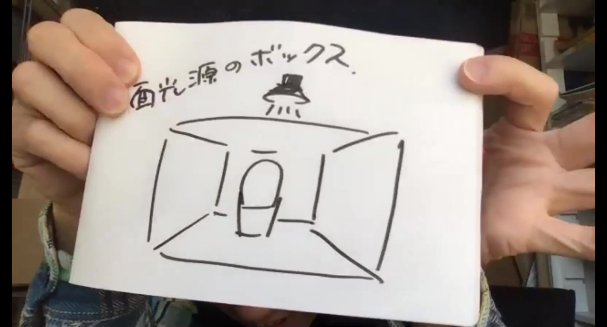

# 照明

---

* 太陽光がベスト。太陽光をうまく使うのが良いと思う。

* 晴天じゃなくてうっすら曇り空でも良い。とにかく明るさに差がでないことが重要。夜だけなど、朝から夕方にかけて撮影するときには太陽光は向かない。

* 光の強さが一定であることが大切。太陽光は時間によって明るさが変わってしまうため、時間を置かずに一気に撮ろることが重要。

* 太陽光は点光源なので、反射しすぎない乳白色のもの（ex.プラ段や障子紙など）を間にはさむと良い。
。

---

* 小物を撮影する時には、ライティングボックスを自作しても良いかもしれない。床と壁をマットな白い板で作って、天井として乳白色のプラ段や障子紙を貼る。その上から光源を落としてあげれば中に置いたものはキレイに照らされる。

・背景として白いシートを置く場合は、壁と床のパーツを別に作って貼り合わせると、どうしても線（影）ができる。そこで、一枚のシートを緩くカーブさせるようにして壁と床を繋げてやると、線が無くなり、白く広い空間にモデルを置いたような映像を撮ることができる。

* 向こう側にライトがあるときに、高さのあるものを撮影する場合は、こちら側にレフ板や他のライトを用意すると良い。

* 蛍光灯の光で動画を撮影するとチラつきが入ってしまうため、LED照明の使用がおすすめ。
