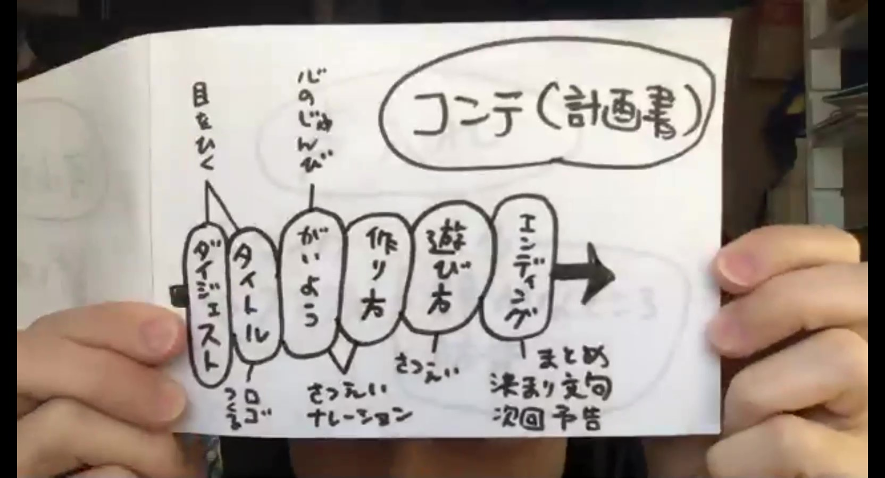

# コンテ（計画書）をつくる

ザックリでもいいので、とにかく計画を立てる。
そうすると、どんなものが必要か、準備期間が必要かが見えてくる

だいたいこんな感じで、書き出してみると、必要なもの(撮るべきシーン、画像素材)が分かってくる。この図だと真ん中が動画の流れ(シナリオ)で、上に見た人が感じて欲しいこと、下に各シーンで必要な素材や準備を書き出している。

[**UTV**](https://www.youtube.com/channel/UCYRPjnHu16cevb7H7RcaYFA)の動画はどれもこの流れになってるので、見比べてみると分かりやすいかも。
