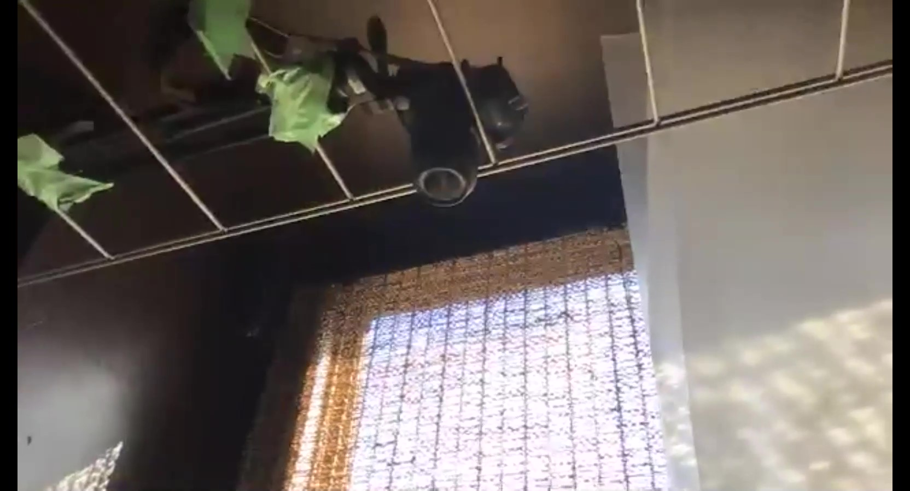
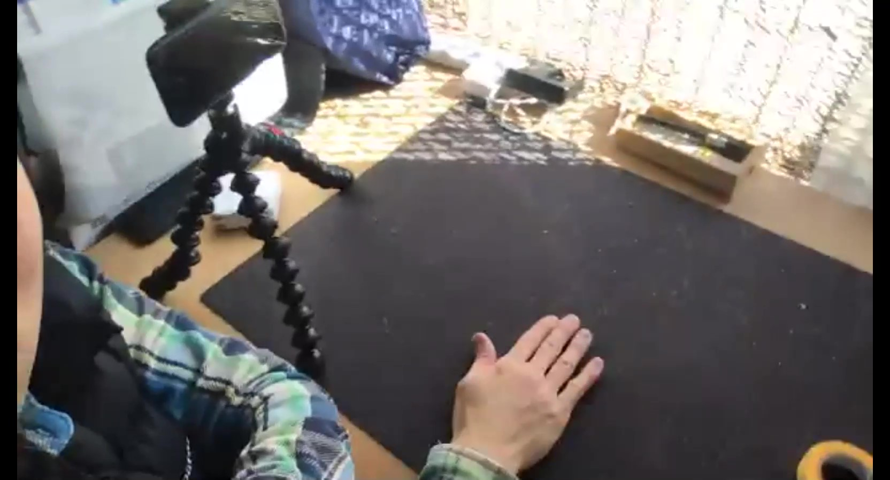
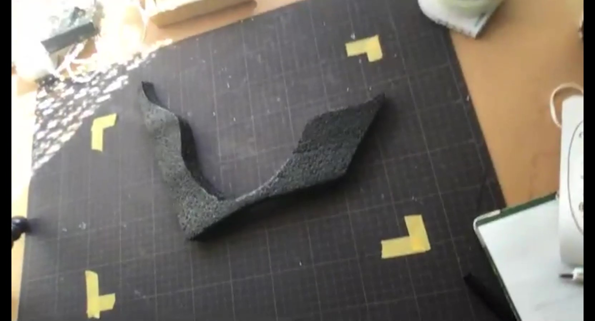

# 撮影する前に気を付けたいこと

---
### 撮るときに大事なこと（考えること）
* #### 撮るものは？
* #### どう撮る？
* #### どう見せる？
---

### カメラの位置
[**UTV**](https://www.youtube.com/channel/UCYRPjnHu16cevb7H7RcaYFA)では、手元の工作を撮影したいので、手元を映したかった。

なので、真上にカメラを固定するべく、家に余ってたMUJIの棚のフレームと、養生テープを使って、カメラを固定した。

三脚がついてるのはよりガッチリ固めるため。

### 背景
工作に使う素材が白っぽいものが多いので、黒いカッティングマットを敷いて分かりやすくしている。

### ばみる

あらかじめ、映像に移る範囲をマーキングしておくことを"ばみる"という。カメラのプレビュー画面をのぞきながら。どこまで映像に収まるのか、マスキングテープで印をつけとく(もちろんマスキングテープ自体は映像に入らないように.)

こうしておくと、しっかり映像の中心で工作の様子を写したり、被写体を動かすことができる

### フォーカス

フォーカスを固定できる機材で撮影するなら、焦点があって欲しい高さにフォーカスを固定しておくと良い。

オートフォーカスだと、ピントが合って欲しくない所にいってしまい。見せたい所がボケてしまうことがある
