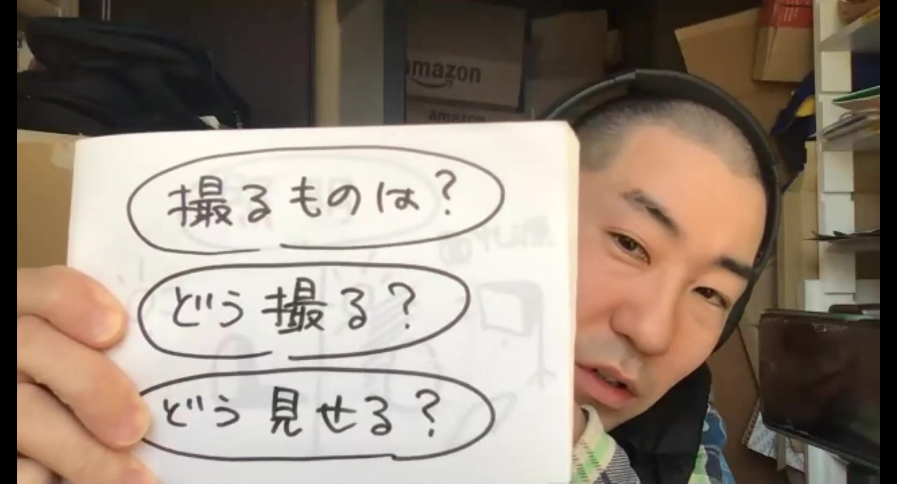

# 撮影する前に気を付けたいこと

---
### 撮影時に考えておくこと
* #### 撮るものは？
* #### どう撮る？
* #### どう見せる？
---

### カメラの位置
* [**UTV**](https://www.youtube.com/channel/UCYRPjnHu16cevb7H7RcaYFA)では、手元の工作を撮影したいので、手元を映したかった。なので、真上にカメラを固定するべく、家に余ってたMUJIの棚のフレームと、養生テープを使って、カメラを固定した。三脚がついてるのはよりガッチリ固めるため。

### 背景
* 工作に使う素材は白いものが多いので、テーブルにはカッティングマットを敷いて見えやすくしている。

### バミる

* 映像に移る範囲をマーキングしておくことを”バミる”という。カメラのプレビュー画面をのぞきながら、どこまで映像に収まるのか、マスキングテープで印をつけておく。（もちろんマスキングテープ自体は映像に入らないように。）こうしておくと、工作の様子を画面の中心に映したり、被写体を画面からはみ出さずに動かすことができる。

### フォーカス

* フォーカスを固定できる機材で撮影するのであれば、焦点が合って欲しい高さにフォーカスを固定しておくと良い。オートフォーカスだと、ピントが合って欲しくない所にいってしまい、見せたい所がボケてしまうことがある。

* 宇佐美さんの場合、ものを手で持って撮影することが多い。その高さと同じくらいの高さのもの（ex.カップなど）を撮影エリアに置いて、そこにカメラのフォーカスを合わせるなどして、きれいに撮影できるよう調整している。
