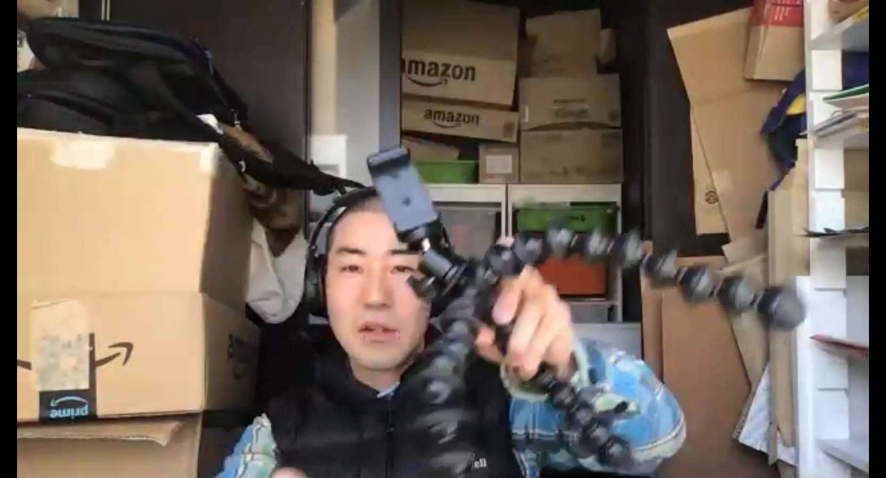
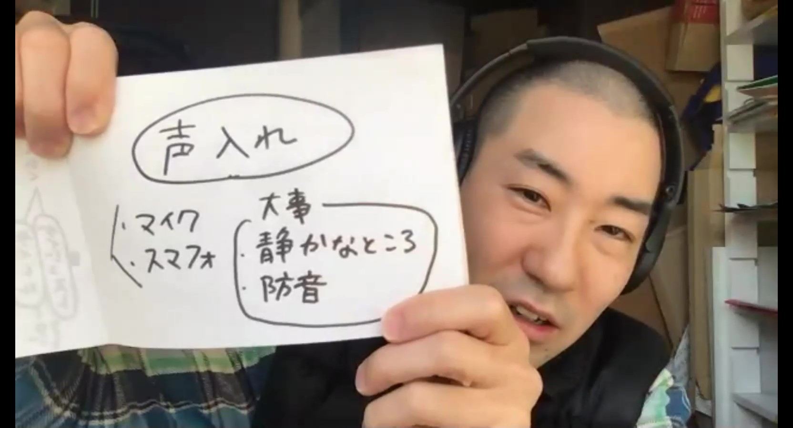

# 声入れ(ナレーション録音)

* マイク
* スマフォ

何を使うかも重要だが、それよりも静かなところ＋防音環境で撮影することが大事。

小さな三脚があると良いと思う。スマホを口元に近づけて固定できるので。こんな感じのタコみたいな三脚だと色々使えて便利↓

音は自宅で録音することが多い。とにかく静かな場所を探そう。

押入れの上に布団をたらして、簡易防音室を作って録音していたこともある。布団は防音性能が高いので、布団にくるまって録音するのも良い！

冷蔵庫、エアコン、換気扇はうるさい。寝室がベスト。

風呂場やトイレは反響しそうだが、それをうまく使うこともできる。

まずは色々な場所で試してみるのが良いと思う。

[奥田民生氏のDIYレコーディング実験の数々](https://makezine.jp/blog/2018/04/tamiocantabile.html)は、見てて面白いし参考になる。
